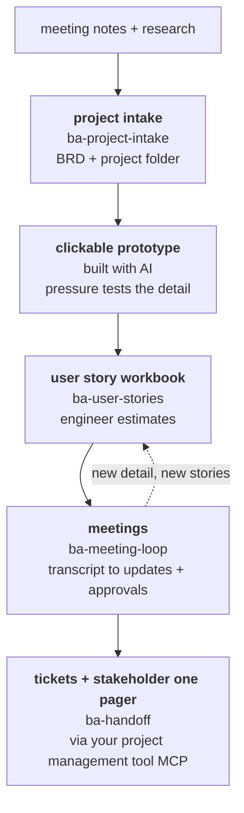

# AIBA.Skills

This is a business analysis method written down carefully enough that both a person and an AI assistant can work from the same pages. It came out of running real projects rather than out of a textbook, and it tries to stay light on the work where a mistake costs an afternoon while getting properly rigorous on the work where being wrong costs somebody money.

The whole pipeline has been run end to end. Meeting notes became a BRD, the BRD became a clickable HTML prototype, walking stakeholders through that prototype produced a user story workbook, an engineer priced the stories from it, and an AI connected to the project management tool opened the tickets directly from the workbook. What sits in this repo is that same sequence generalized, so it can be run again on a different project by a different BA.

## The pipeline

The dotted line back from meetings to the workbook is the part people miss. The pipeline is not a conveyor belt that runs once, it is a loop that keeps returning to the workbook until the scope stops moving.

The prototype step is a role rather than a particular technology, and what it exists for is to pressure test the detail before anybody starts building. On UI work a clickable HTML mock does that job well. On headless work you get the same effect from walking a sequence diagram, poking around a vendor sandbox, or running a pilot migration. The only fair reason to skip it is that the scope genuinely has no behaviour worth pressure testing.

Five skills sit off the main line and only load when something calls for them. `ba-change` comes in when a directive changes something that was already agreed. `ba-formal-signoff` when a contract or an audit needs a spec somebody can sign. `ba-process-mapping` when the deliverable is a documented process rather than a system, or when a build needs its current state mapped or a runbook written. `ba-bid-response` handles the case where the method itself has to go into a proposal, and `ba-vendor-selection` the case where the honest answer is to buy rather than build.

Three of the nine have not been through a live engagement yet. `ba-formal-signoff` is waiting on a real contract, `ba-process-mapping` on a real process, and `ba-change` on a real directive landing in the middle of a sprint. All three were built lean from practice rather than invented from scratch, but it is the first live run that will actually harden them.

## The four dials

Rigor is not a property of the project type. It comes down to four questions that get answered once at intake and written into the project folder, and every other skill reads those answers there instead of asking you again.

| Dial | Question | What it changes |
|---|---|---|
| Security tier | Who bears the cost of failure, and whose data is handled? | Internal only: access control, and the rest gets fixed when it hurts. Client logins, client data, or external blast radius: security and integration resilience stop being negotiable. Tier 2 plus, meaning a named compliance regime applies or a client security review is coming, replaces the catalog defaults with their numbers. |
| Formality | Who pays if we are wrong, and how big is the blast radius? | Internal rework: stay lean. Real stakes without a contract: recorded approvals, but no spec ceremony. Contract or client money: verification per story, recorded approvals, and formal sign off becomes available. |
| Mandate mode | Did we decide to do this, or were we told? | Mode A, mandated: stop chasing sponsors for success measures, record their absence honestly and reconstruct the reasoning from the message trail instead. Mode B, delegated: you are designing the logic, so keep a decisions log, because nobody else will be able to reconstruct it later. |
| Handoff | Who builds it? | Self build, engineer, vendor builds, buy a product, inherited, or undecided with a decision date attached. It changes how much detail the stories carry and whether estimates round trip. This is the one dial that may differ epic by epic, which is what the buy the core and build the edges answer needs. |

## Skills

| Skill | Use when |
|---|---|
| [ba-project-intake](skills/ba-project-intake/SKILL.md) | A new project starts. Sets the dials, creates the folder, writes the BRD. |
| [ba-user-stories](skills/ba-user-stories/SKILL.md) | Writing or reviewing the story workbook. Fields, IDs, acceptance criteria, failure paths, NFRs. |
| [ba-meeting-loop](skills/ba-meeting-loop/SKILL.md) | A meeting happened. Transcript in, updates and approvals out. |
| [ba-handoff](skills/ba-handoff/SKILL.md) | Stories go to an engineer for estimates, to the tracker as tickets, or to a stakeholder as a one pager. |
| [ba-change](skills/ba-change/SKILL.md) | Priorities flip, a decision reverses, an approval is withdrawn, a decision happened verbally, a fix ships before the paperwork, or nobody will approve and work has to proceed anyway. |
| [ba-formal-signoff](skills/ba-formal-signoff/SKILL.md) | The formality dial says contract. Generates a signable spec from the story set. |
| [ba-process-mapping](skills/ba-process-mapping/SKILL.md) | The deliverable is a documented process, not a system, so there are no stories. Also covers current state maps and runbooks inside builds. |
| [ba-bid-response](skills/ba-bid-response/SKILL.md) | Bidding. The proposal's method section and the line by line compliance matrix, before any project exists. |
| [ba-vendor-selection](skills/ba-vendor-selection/SKILL.md) | Buying instead of building. Vendor RFP, demo scripts, scoring matrix, TCO, recommendation. |

## Assets and scripts

`assets/` holds everything a new project starts from: the story workbook template with its closed sets already wired up as dropdowns, the bid compliance matrix template, and the project folder skeleton, which is a README plus the four knowledgebase files 01 to 04. Copy the folder, rename it, and fill in the dials. Both workbooks ship with one example row that passes the validator, which is there to show you the format and then be deleted.

`scripts/validate_workbook.py` runs the mechanical half of the ba-user-stories review pass over a workbook. It catches blanks, the closed vocabularies that do not depend on 01, dependencies that dangle or point into quarantine, approvals missing a role or a date, debt records that are past their revisit date or quietly piling up, and the vague word scan. On top of that it reports three heuristics that never block anything: failure paths, the NFR categories that are non negotiable for the project's tier, and the count of open debt records. It reads a CSV export as readily as it reads a workbook, so a project whose store is a tracker rather than Excel can be swept the same way. Passing `--matrix` validates a bid compliance matrix instead. What the script does not cover is listed in ba-user-stories, and the review pass written there stays the specification, with the script only ever automating part of it. It needs Python and openpyxl, and `--selfcheck` runs its own tests.

`scripts/make_templates.py` regenerates the two xlsx templates. Their dropdowns are built from the same vocabularies the validator enforces, so what a BA is able to type and what the sweep will accept both come from one place. Run it after changing a closed set, and run `--verify` when you want to confirm the committed templates still match.

## Principles

- Best practice is the default, and every gate has an escape hatch behind it. A mid size company does not run everything by the book, and pretending otherwise only moves the work off the books where nobody can see it.
- Never quietly invent a requirement. Facts go in unmarked, inferences go in as assumptions with an owner attached, and unknowns go in as open questions. A blank cell is banned outright, because a blank forces whoever reads it next to guess. Write None instead.
- Each fact lives in exactly one place, since restating the same thing in two files is how two versions of it start drifting apart.
- Approvals get recorded on the day they happen, with a role and a date. A yes that nobody wrote down does not exist once scope is being disputed. Silence does not count as a yes either, and a directive only approves the thing it actually says, which ba-change goes into properly.
- The record is allowed to bend, but it is not allowed to break. Priorities flip and decisions get reversed, and when there is no time the method will happily record less detail than usual, but it will not record something untrue. Anything settled at intake changes only through a recorded change event.
- AI drafts, the BA checks the draft against reality, and the stakeholder confirms, in that order. Content an AI generated that nobody who knows the business ever checked is the most expensive kind of wrong, precisely because it reads as though it is right.

## Privacy and voice

Organizations and people are referred to by role rather than by name, everything is written in English, and vendor names for project tools and AI assistants are kept generic, which is why you will see phrases like your project management tool and a leading LLM.
