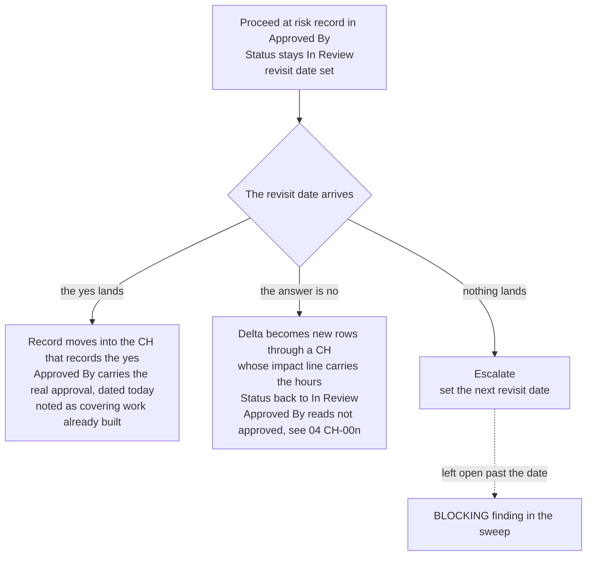

# BA Change Control

Most of what a BA writes down sits unread until the day somebody argues about it, and this skill covers the situations that tend to produce those arguments. Priorities get reshuffled, a decision everyone thought was settled comes back reversed, an approval is withdrawn, or the approval you have been waiting on simply never arrives. None of that is unusual, and none of it is a reason to let the record go quiet. When there is genuinely no time, writing down less than usual is a fair trade. Writing down something that is not true never is.

## The change event

When a single decision from management lands on fifteen stories, that goes in as one record rather than fifteen, because the thing you will need to explain a year from now is the decision itself and not each row it happened to touch. A change event is a decisions log entry in 04_Worklog.md, and it carries:

- a handle, which is CH-001 by default, sequential per project, and declared in 02_Conventions.md the way any register is
- the story IDs it touches
- one provenance, meaning the directive itself, whether that is the email, the read back note, or the transcript quote
- what changed, and why
- one impact line giving hours in and out against the priced baseline, or "not yet priced" if estimates do not exist yet
- who decided, and the date

The rows it touches cite it rather than restating it, so you write "per CH-001" in Description / Notes, or in Approved By when the thing that changed is the approval itself. The CH entry is the worklog line, so do not go and write a second one.

A dial that moves counts as a change event too, and dials tend to move in packs. What intake owes afterward is set out in ba-project-intake under When a dial moves.

## What a directive approves

A directive approves exactly what it says, at the level of detail it says it, coming from the people who own what it touches.

- Stories the directive names move with the CH as their provenance. Stories the BA works out are impacted are inferences rather than instructions, so they go in as "[ASSUMPTION] impacted by CH-001" and get proposed through the normal meeting loop.
- The BA's elaboration of a directive into new stories and criteria is new content, so it starts at Draft and earns its own yes. "Cut module X, ship Y by Friday" approves the cut and the date, and it does not approve the acceptance criteria somebody writes afterward.
- Joint approvals stay joint. One approver's directive covers their side of it only, and the change is not approved until every approving role has landed, which is the same rule that applies to stories.
- Two directives that conflict freeze each other, and neither one propagates. What resolves it is one read back to both parties along the lines of "we have two instructions, X and Y, which stands?", and whatever comes back becomes the CH. Improvising a tie break is exactly the unrecorded judgment this method exists to prevent. The freeze is its own change event on the day it starts, with both directives as its provenance, and the rows they touch carry "frozen per CH-002, revisit [date]" so that the sweep can see it, because otherwise the record ends up reading as though the first directive won. A freeze is not a stop, so work already in flight continues on the last settled instruction and the engineers are told exactly that. The freeze runs on the read back window, since a read back is how it gets resolved. If it is still unresolved when that window passes, escalate it, either to whoever owns both parties or, where nobody owns both, each side to its own owner with the conflict itself going to the sponsor as a blocking issue. The one thing the BA never does is resolve it by choosing.

## Verbal decisions

A hallway decision is a real decision, and creating the record of it is the BA's job.

- Write a dated read back note into sources/ and send it to whoever decided: "as discussed: X, Y, Z, is that correct?"
- Their reply is both the approval and the provenance.
- Silence is never a yes. Once the default window passes, which is 2 business days unless 02_Conventions.md declares another, proceed at risk applies, and the note gets labelled "read back of [date], unchallenged as of [date]" and is never rendered as though it were a written yes.
- Sources are evidence, so annotate them by prepending a clearly marked note, whether that is a correction or a pointer to the CH that superseded it, and never edit the original text.

## The settling window

Directives reverse more often than anyone expects. Update the workbook immediately, and propagate only on confirmation.

- Workbook rows and the CH entry go in the same day. 01 only gets touched when a fundamental has moved, in the sense ba-project-intake gives that word, and a reprioritization inside existing scope never touches it at all.
- Tickets, estimate flags and re estimate requests wait until the directive survives its window, which is the read back window above for verbal directives, and for written ones a checkpoint declared in 02_Conventions.md, defaulting to end of week.
- A reversal inside the window costs one CH entry and nothing downstream, which is the entire point of having a window. Nothing in this section delays the record itself, it only delays the propagation of a decision that may well not be final.

## When an approval changes

- A phase or priority move with unchanged content keeps its approval. The exception is a move that changes whether the thing ships at all, meaning a move to Out of Scope or Backlog, which needs the CH directive as its authority cited on the row, and joint approvals stay joint even there.
- Putting work on hold is Status Deferred, citing the CH and a revisit date in Description / Notes. That is precisely what Deferred is for, in that it marks the story the project has stopped pursuing without deprecating it. A hold with no revisit date is a story quietly dying, which is the outcome the status exists to prevent.
- Reordering inside a phase has no field of its own, and MoSCoW is a commitment level rather than a rank. The CH is the record of the order, and once tickets exist the tracker's own ordering carries it. Add a rank column, declared in 02_Conventions.md, only when the workbook itself genuinely has to hold the order.
- A change to the User Story, Description, or Acceptance Criteria of an Approved story sets Status back to In Review. A new Assumption or Open Question does not, because those arrive on approved stories as normal business.
- Approved By is never blanked. Annotate it instead, along the lines of "superseded, see 04 CH-002", so that the original yes stays on the record, since blanking it destroys the history the field exists to hold.
- A defect reopens a Done story, so Status goes to In QA with the defect and its CH or incident note recorded in Description.
- Estimates are never blanked or overwritten when a direction gets abandoned. The CH entry records "estimates for [IDs] superseded, [total]h, [reason]" and the columns stand as history, because the hours priced for a build that never happened are the comparator the next build versus buy decision is going to ask for.
- The tracker follows along behind, which ba-handoff covers.

## Proceeding without a yes

Recorded approvals are mandatory on Firm and above, and some cultures never approve anything in writing. The honest state in between yes and nothing gets written into Approved By:

"Requested [role], [date]; no response as of [date]; proceeding at risk per [recorded directive or mandate]; revisit [date]"

Status stays at In Review. This needs a real request that was actually sent, a recorded mandate to cite, and a revisit date. Escalating to the sponsor first is the right move and worth a line in 04, but the record is the thing that matters. On Contract this state records a gap and never authorizes work, so the story goes to the spec's assumptions section or it blocks signature.

In mode B nobody directed anything and the delegation is itself the mandate, so cite the CH entry that records the decision to proceed.

The revisit date is a conversation rather than a reminder, and it has three possible endings:

Taking them one at a time. The yes lands, in which case the at risk record moves into the CH that records the yes and Approved By carries the real approval dated today, noting that it covers work already built, which is the same supersede into 04 as any overwritten approval and is recorded late rather than backdated. The answer is no, in which case the delta between what was built and what the approver actually wants becomes new rows through a CH entry whose impact line carries the hours, and the superseded at risk record is the thing that makes that rework a priced change rather than somebody's mistake. The original row then ends the same way it would have on a yes, with Status back to In Review, the at risk record moved into that CH, and Approved By carrying "not approved, see 04 CH-00n", because a record whose revisit date has passed and whose answer has arrived is closed history, and leaving it open blocks every sweep from here on for a question that already has an answer. Or nothing lands at all, in which case you escalate and set the next revisit date.

The tripwire is that an at risk record past its revisit date is a blocking finding. Proceeding at risk is a pressure valve rather than a way of life.

## Shipping before the record

Sometimes there is a production fire, a hotfix, or a change that has to ship this afternoon. The record follows the work instead of gating it, so you ship, and then within 5 business days, unless 02_Conventions.md declares another window, you write the story, the approval or its proceed at risk record, and the change event, all carried as a debt record on the authority of whoever ordered the ship. The one thing never deferred is the failure path on the fix itself, because a hotfix written blind is how one incident turns into two. The row is not deferrable either, so create it at ship time with its ID, one line naming what shipped, Type, Epic, Phase and Priority as usual, Status Draft, the failure path in Acceptance Criteria, None in everything else, and the debt record with its CH handle and revisit date sitting in Approved By. Until that row exists, the deadline exists nowhere.

Urgency is not a formality setting. The dials do not move because something is on fire, and a fire on a tier 2 system is still a tier 2 system. On Contract the deferral is not the BA's to make at all: the incident owner authorizes the ship in writing, that message becomes the mandate, and the story gets written and approved before the next release rather than merely within the window. Write that on the row as the release's calendar date, placed after the word revisit, because that is what the sweep actually reads and a deadline nothing reads is a deadline nothing enforces.

## The debt record

Every deliberate deferral in this method has the same shape: what is owed, why, on whose authority, meaning either an approver's yes or a cited mandate where no yes exists, and by when.

It lives on the story rows it defers, and it carries the literal word revisit followed by its date, because that is the only thing the sweep reads. Where the row does not say otherwise the field is Description / Notes, while the at risk record and the paperwork a shipped fix owes both live in Approved By, and a quarantine marker lives in Assumptions. A deferral with no row does not exist, so write the row first even if all it manages to say is what is owed. That is the whole of the enforcement, since a record kept only in 04 is a promise nobody is ever going to be reminded of.

The instances are these: an accessibility target deferred on an MVP clock, which is category 7 in nfr-catalog, noting that categories 3 and 4 stay non negotiable on tier 2 and cannot be deferred this way at all; the proceed at risk record above; the paperwork a shipped fix owes; and an unaudited backlog held in quarantine on a rescue, which ba-project-intake covers. Anything past its revisit date is a blocking finding, because a deferral without an enforced revisit is really just deletion with paperwork attached.

Count them as well as watching their dates. Three or more open records of any of those kinds on one project is a finding about the project rather than about any record in it, since what it usually means is that the work is outrunning the authority to do it, and that is a conversation with whoever set the pace. Escalate the pattern rather than the individual items, because every record being individually defensible is exactly how a project ends up with an indefensible pile of them.

## Defect or decision

When shipped output turns out to be wrong, the first question is which record answers for it. For migrated or loaded data that record is the exclusion register and the cleansing rules in the data mapping reference. If it is in the register with an approver against it, it was a decision, so point at it. If it is not in the register, it is a defect, so reopen the story with the reconciliation delta as the evidence. For behaviour, meaning something like a total that aggregates differently or a rule that now fires somewhere else, the record is the acceptance criteria of the story that shipped it. If the criteria contradict what happened, it is a defect. If the criteria never addressed it, that is a gap in the criteria rather than a bug worth arguing about, so the missing behaviour becomes new rows through a CH entry and the shipped story stays Done, because it did what it said it would. An order to keep going is itself a decision, and it gets confirmed in writing under the verbal rule before it changes any priced or approved artifact, then recorded as one change event.
