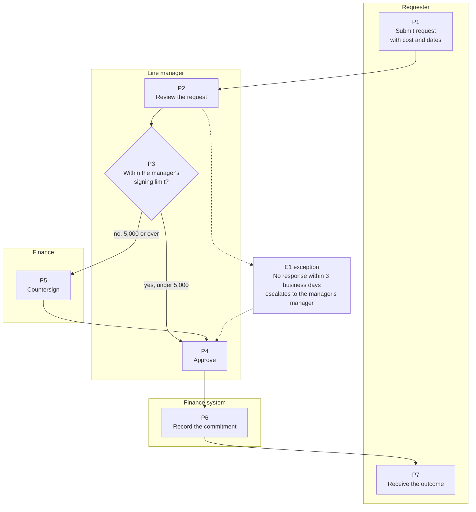

# BA Process Mapping

This has not been exercised on a live process yet, so harden it the first time one runs through.

A process document answers four questions, which are who acts, what they do, what they decide, and what happens on each branch of that decision. Everything beyond those four is decoration.

The skill also runs inside a build project, whether that means mapping the current state before requirements or writing a runbook for a cutover, a release, or an incident response. It is the same capture list at a smaller scope, and there is no separate intake for it.

## Project shape

Same intake and same folder as ba-project-intake, minus the workbook, with the knowledgebase carrying the process document in place of stories. The dials still apply, so an HR process touching personal data runs at tier 2 discipline for who is allowed to see the sources, and a process tied to policy or compliance runs at Contract formality with recorded approvals.

## When the process and a build compose

A redesign that lands inside a system, such as a new process implemented through CPQ configuration or an approval flow becoming an app, is one project holding both artifacts in one folder. The seam rule is that a step a human performs stays in the process document while a step the system performs becomes a story. Steps carry stable numbers, P1, P2 and onward, that survive edits, and each story implementing a step cites it in Description as something like "implements P4". Walkthrough feedback on the flow lands in the process document while feedback on system behaviour lands on the story, and the meeting loop's destinations table covers both cases.

## Capture, per process

- **Trigger.** What starts it, whether that is a request, a date, or an event. Processes with fuzzy triggers fail right at the front door.
- **Actors.** Roles rather than names, covering the person who requests, the person who approves, the person who executes, and the person who gets informed.
- **Steps.** Numbered, each one an actor plus a verb plus an object, along the lines of "The manager approves the request." Passive voice hides the actor, and a step with no actor is a step nobody actually does.
- **Decisions.** Every branch point, with its rule where one exists and an [OPEN] where it does not. "The director decides" is a decision, and on what basis they decide is the requirement.
- **Exceptions.** What happens when the approver is away, the deadline passes, the request is withdrawn, or the system is down. These are the same failure lenses used for acceptance criteria, applied to a process instead. Most process disputes live right here, in the paths nobody bothered to write down.
- **Systems and records.** Where each step happens and what evidence it leaves behind. When a tool encodes a step, such as an escalation order or a routing rule, the tool's configuration is the source and the document points at it, because restating it just creates the second copy that drifts.
- **SLAs.** How long each step is allowed to take, assuming anyone has actually committed to anything.

## Diagram

One flowchart per process, written in Mermaid and committed next to the document so that it renders in the repo. Use swimlanes by actor when three or more actors are involved, and a plain flowchart below that threshold. The diagram is the executive view while the numbered steps are the specification. A diagram on its own is not a process document, and prose on its own gets skimmed, so ship both and keep them describing the same steps. When they disagree, the numbered steps win and the diagram is the defect.

Current state and future state get separate diagrams whenever the work is a change, because mixing them into one picture is how what we do and what we wish we did end up confused in review.

### A worked example

This is a spend approval, drawn the way the capture list above asks for it. Every lane is an actor, every box carries its step number, the decision shows the rule it turns on, and the exception hangs off the point where it fires.

Three things in that picture are the point of the whole skill. The decision at P3 names its rule, so nobody has to argue about which path a 5,000 request takes. The exception E1 is drawn rather than left to prose, because the path where the approver is on leave is the one every real dispute walks down. And P6 sits in a system lane, which is the seam rule made visible: when this process gets built into software, P6 is the step that becomes a story while P1 through P5 stay in this document.

## Variants

Processes fork on size and on kind, so a short trip differs from a long trip and a standard request differs from an exception. Two rules keep variants manageable. The first is that a variant only earns a separate flow when actors or approvals differ, rather than when merely the values differ. The second is that you name the discriminator explicitly at the top, along the lines of "trips of 14 days or more follow process B", because an unnamed discriminator means every case begins with an argument about which process applies.

## Controls view

When the audience is an auditor or a compliance platform, the process document renders into a control matrix rather than being rewritten, giving one row per control with objective, control activity, owner, frequency and evidence, all of which are derivable from the capture. The step becomes the control activity, the actor becomes the owner, the SLA becomes the frequency, and systems and records becomes the evidence artifact. Two columns are new and get added deliberately, those being the control objective, meaning why this control exists in the framework's own language, and the mapping to the framework's criteria, such as a SOC 2 trust services criterion or a CIS control. Evidence entries carry an owner and a retention period, because the auditor's question is never whether there is a log, it is whether you can show twelve months of it and say who produces it on request.

The repo is the source and the auditor never opens it, so render out to whatever the audience actually consumes, whether that is the compliance platform's entries or a PDF, and regenerate on change under the same rule the one pager follows.

## Review

Walk the document with the people who live the process, one step at a time, asking on each step whether this is what actually happens or what is supposed to happen. Record both when they differ, because the gap between them is usually the finding that matters most. Approvals get recorded with a role and a date, exactly as they are on stories.

For a time critical process, run one timed dry run before approval, since a walkthrough confirms the steps but only a drill confirms the SLA.
