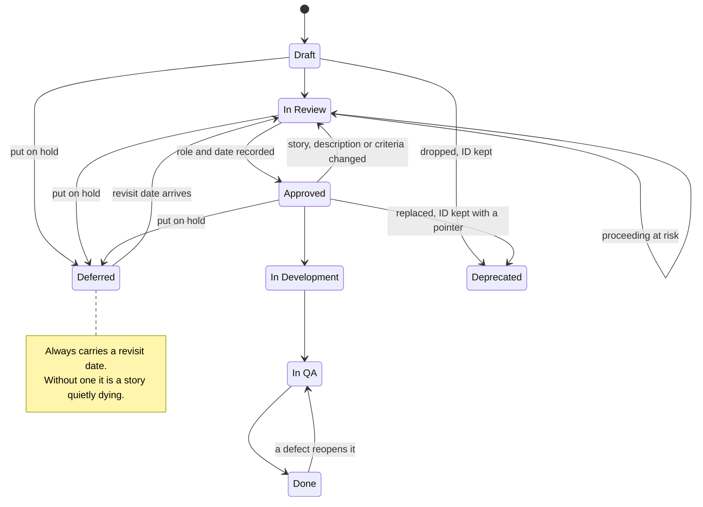

# BA User Stories

One workbook, one row per story, machine readable by construction. The workbook is the handoff artifact, in that the engineer estimates inside it, the stakeholder approves against it, and an AI connected to your project management tool creates the tickets from it. Everything below exists to keep those three uses working at once.

The sixteen fields are the contract, and the workbook is only the default rendering of that contract. Excel stays the default on purpose, because most organizations are Microsoft first and a stakeholder who will never open a tracker can always open a spreadsheet. In an organization that genuinely will not touch Excel, a tracker or a Notion style database can serve as the native store instead, but only if it carries every field below, and 02_Conventions.md has to name which store is authoritative. The discipline lives in the fields rather than in the file format.

## Story ID

One prefix per project, drawn from the project name, so a portal project might use MSP. They run sequentially, zero padded, and are never reused. A deleted story keeps its ID with Status set to Deprecated and a pointer to whatever replaced it, because people quote IDs in threads that outlive the workbook by years. Check the backlog for the highest ID before assigning a new one. There is no second numbering of stories anywhere, meaning no separate requirement, objective, or criterion numbering, and acceptance criteria live on the story row itself. Registers for things that are not stories, such as process steps (P), change events (CH), or a client's own requirement IDs in a bid, get declared in 02_Conventions.md and stay in their own lane.

## The field set

There are sixteen canonical fields, one column each, with exact names. The two engineer columns are extras that appear when the handoff dial says engineer for any epic. The file `assets/story_workbook_template.xlsx` is those sixteen plus the two engineer extras, with the closed sets already wired up as dropdowns, and you delete the extras when no epic says engineer.

| # | Field | Rule |
|---|---|---|
| 1 | Story ID | See above |
| 2 | Date Created | |
| 3 | Type | Story, NFR, or Constraint. Closed set. Lets coverage be checked by filter. |
| 4 | Epic | One of the epics in 01_Requirements_Source.md. Closed set. |
| 5 | Phase | Phase 1, Phase 2, Backlog, Out of Scope. Closed set. Phase never leaks into other columns. |
| 6 | User Role | One of the roles in 01. Closed set. |
| 7 | User Story | As a [role], I want [capability] so that [benefit]. One sentence. |
| 8 | Description / Notes | Context and decisions behind the story. For feature work, field level detail lives here rather than in a separate document. When the detail is itself an artifact, such as a field mapping matrix or an eval set, it lives in a companion sheet the row points to, because forty mappings crammed into one cell serve nobody. |
| 9 | Acceptance Criteria | Given / When / Then preferred. Every bullet testable. See below. |
| 10 | Priority (MoSCoW) | Must, Should, Could, Won't. Nothing else. Not "Must (Phase 2)", since phase has a column of its own. |
| 11 | Data Source | Which system feeds or receives this. Closed set from 01. |
| 12 | Dependencies | Story IDs or None |
| 13 | Assumptions | What is being taken as true. Never blank: write None. |
| 14 | Open Questions | What needs an answer and who owns it. Never blank: write None. |
| 15 | Status | Draft, In Review, Approved, In Development, In QA, Done, Deferred, Deprecated. Closed set. A content change on an Approved story returns it to In Review, and a defect reopens a Done story to In QA. See ba-change. |
| 16 | Approved By | Role and date, filled in on the day the yes actually happens. Joint approvals carry every approving role and date, and the story is not Approved until the last one lands. Blank means not approved, and 143 hours of build against a blank column is a dispute waiting for a venue. Never blank it once it is filled, because a superseded approval gets annotated rather than erased. When approval cannot be obtained and work has to proceed anyway, the proceed at risk record from ba-change goes here, since it is the one honest thing that is neither a yes nor a blank. |
| 17 | Estimated Hours | The engineer fills this, and the BA writes N/A on rows outside the engineer epics before the workbook goes out. Extra column. Hours is the default unit, and a team that estimates in points declares that unit in 02_Conventions.md rather than bending the column. |
| 18 | Estimate Notes | Engineer fills. Extra column. |

The Status column is the one field with rules about how it moves rather than just what it may contain, so it is worth seeing whole:



The two edges that get forgotten are the ones pointing backwards. A content change on an Approved story returns it to In Review, and a defect returns a Done story to In QA, because a status that only ever moves forward is a status that stops describing reality the first time something goes wrong. Proceeding at risk is drawn as a self transition on purpose, since it records a state without advancing one.

Then there is the hallucination proofing, which is the set of rules that make the workbook safe for an AI to read and extend:

- **Blanks are banned.** None and N/A are both answers. A blank forces the next reader, human or AI, to guess whether the BA did not know or whether there is genuinely nothing there.
- **Provenance goes on facts.** When a detail came from a particular person or meeting, say so inline, along the lines of "per the MS Portal Owner, 6 May 2026". A claim with a source attached can be checked, and a claim without one gets treated as an assumption.
- **Closed vocabularies stay closed.** The moment "Must (Phase 2)" shows up, both filters and AI parsing start to degrade. If you need a new value, change 02_Conventions.md first and then use it.
- **Extra columns are declared rather than smuggled in.** The engineer columns set the pattern here, so a project that needs another column, whether that is a delivery team, a UAT verdict, or a process step reference, registers it in 02_Conventions.md first. An undeclared column is where notes float loose and parsing quietly dies.
- **One row is one story.** No merged cells, no second header row, and no notes floating around in unrelated cells.

For migrations and integrations the field level detail becomes its own artifact, which [references/data-mapping.md](references/data-mapping.md) covers.

## Acceptance criteria

Given / When / Then, with every bullet testable. The happy path is the easy third of the work. The rest comes from asking what goes wrong, and since stakeholders cannot answer that in the abstract, the BA runs the lenses:

| Lens | Ask |
|---|---|
| Input | Wrong, blank, or enormous? |
| Data | Missing, duplicated, or stale record? |
| System | The external system is slow, down, or returns an error? |
| Permission and timing | Access revoked mid flow? Two people act at once? Session expires mid submit? |
| Output | The result is plausible but wrong? Who catches it, and how fast? |

For each hit, two answers become the criteria: what the user sees, and what the system does. Silent failure is never acceptable on a tier 2 project, nor on any path that a decision gets read from regardless of tier, since a report that quietly averages over missing data is a tier 1 bug with tier 2 consequences. On any critical path, meaning a production down flow, a payment, or an approval, the failure behaviour is the actual point of the story rather than an edge case hanging off it.

These are the elicitation questions that get stakeholders producing failure paths, and they work well in walkthroughs:

- What is the worst thing that could happen with this feature?
- When this goes wrong today, how do you find out, and who gets blamed?
- Has anyone ever complained about this? What happened?

Full use case treatment, meaning a numbered main flow plus alternate and exception flows, is worth reserving for the two or three flows per project where failure is genuinely expensive. Everything else stays a story.

### When output varies run to run

"Then the draft is accurate" passes the format check and misses the point entirely, because for a non deterministic feature such as an LLM draft, a ranking, or a recommendation, a per run assertion is not testable at all. Testable means a defined check that somebody can run and get the same verdict from twice. For AI output that comes down to four parts, all recorded on the story:

- **Eval set.** A named, versioned set of real cases, sometimes called a golden set, with a size and an owner.
- **Threshold.** The pass bar written as a number, such as "at least 95 percent of golden set drafts grounded in the cited doc."
- **Measurement.** How it gets judged, whether that is exact match, a rubric, or an LLM judge with a stated human audit rate. The engineer proposes and the business accepts or overrides, which is the same posture used for NFRs.
- **Gate.** What happens when it falls below the bar, and who reviews output in production. A human review gate is a story in its own right, and usually a Must.

The deterministic parts of the same feature, such as latency, citations rendering, and the model down path, stay ordinary Given / When / Then. Red team cases get rows too, covering prompt injection, data extraction attempts, and the output that must never ship under any circumstances, and you declare an Eval or Red team value for Type in 02_Conventions.md before using one.

## NFRs

NFR rows use Type = NFR and the same field set as everything else. Coverage matters more than format here, so read the twelve categories, notice which ones have zero rows against them, and decide deliberately rather than by omission. The defaults and the stakeholder phrasing live in [references/nfr-catalog.md](references/nfr-catalog.md), and the security tier from intake decides which of them are negotiable.

Engineers propose and the business accepts or overrides. Never ask a business stakeholder what their uptime requirement is. Ask them whether 99.5 percent during business hours, which is what the engineers suggest, is acceptable. Arrive with a proposal rather than a question.

## Review pass

Before the workbook goes to anybody, sweep it:

- Every Must in Phase 1 has acceptance criteria that include at least one failure path
- No blanks anywhere in Assumptions and Open Questions
- Every dependency ID exists, and none of them points into a quarantined ticket, which ba-project-intake covers
- Every Approved status has a name or role and a date sitting next to it, and no debt record is past its revisit date, with ba-change holding the instances. Three or more of those open at once is a finding about the project rather than about any row in it. A story that is merely on hold does not count as one, since it was parked by somebody with the authority to park it, but it still owes a revisit date
- Filter Type = NFR and check the catalog categories against the tier. A category is not covered simply because it has a row, so on tier 2 with more than one client, tenant isolation and rate limiting each carry their own row, and an SSO row does not stand in for either of them
- Run the vague word scan against [references/vague-words.md](references/vague-words.md). Each hit has to become a number, a named control, an eval threshold, or an [OPEN]

The mechanical half of that sweep is automated:

```
python scripts/validate_workbook.py <workbook.xlsx> --kb <knowledgebase dir>
```

A project whose authoritative store is a tracker exports those columns to CSV and passes the file to the same command, because a store that cannot be swept is a store that gets reviewed by eye or not at all.

Dates anywhere in the workbook are written the way 02_Conventions.md declares, whether that is 2026-05-06, 6 May 2026, or May 6, 2026, and the reason it matters is that an approval date gets read during a dispute and 06/05/2026 is two different days depending on who is reading it.

This list is the specification and the script is only its automation, so when the two disagree the list wins and the script is the defect. Findings that corrupt the record or break a gate are marked BLOCKING and exit non zero, and those are a value outside a closed set, a dependency that does not exist or points into a quarantined ticket, an Approved row whose approvers are missing a role or a date, a proceed at risk record sitting on an Approved row, a debt record that is past its revisit date or carrying no date at all, and a Deferred row with no revisit date. A proceed at risk record on a Contract project gets reported without blocking, because the record itself is the honest artifact and what Contract forbids, meaning a ticket or a signature, is not visible from inside a workbook. Three of the checks are heuristics and say so in their own output. Those are whether acceptance criteria contain a failure path, whether an NFR row covers a non negotiable category on tier 2, and the count of open debt records, which recognizes them by the word revisit and therefore cannot tell a real one from the same word used in passing. Heuristics never block anything, on the grounds that a keyword match should not be able to stop a handoff.

There are three things the script deliberately does not do. It does not read the Epic, User Role and Data Source vocabularies out of 01, so those three closed sets go unchecked. It cannot tell an approval that never landed from one that is simply not due yet, because the workbook holds no age for it. And it does not know which epics say engineer, so it cannot check that N/A is standing where an estimate does not apply. It also treats every blank as a finding, which means a half drafted row will report several at once, and that is the blanks are banned rule working rather than the script misfiring.

What it cannot check at all is the half that matters most, which is whether the story is the right story, whether an assumption is safe to hold, and whether the criteria describe the business that anyone actually runs. A clean run tells you the workbook is well formed, not that it is correct.
